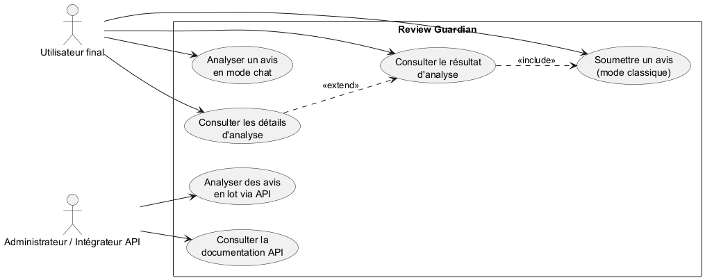
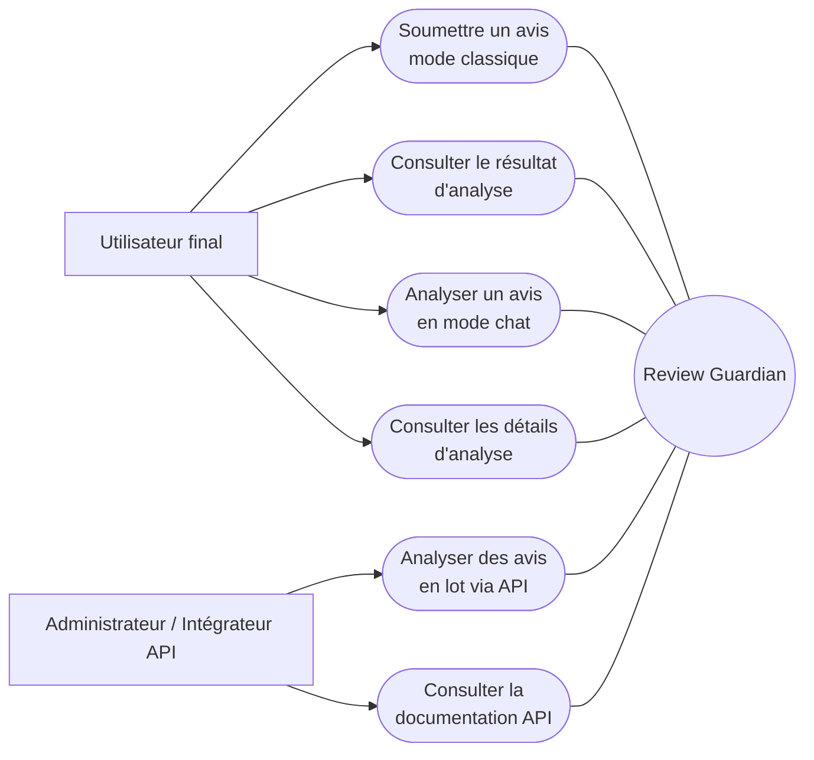
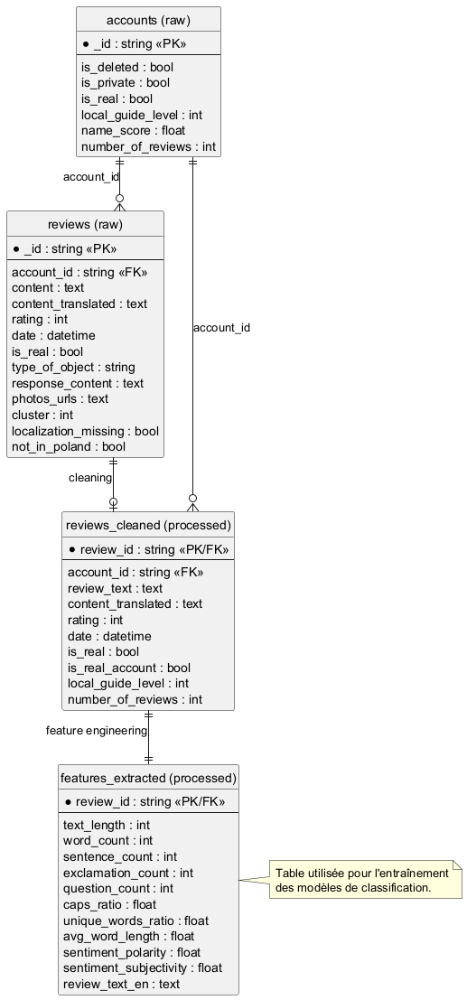
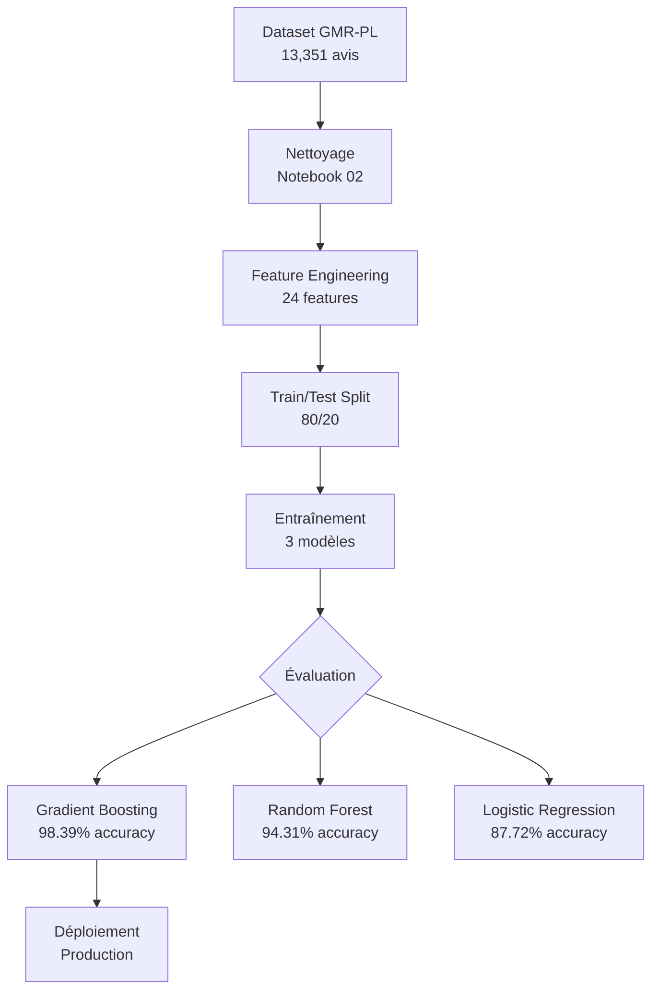

# 🛡️ Review Guardian

**Système intelligent de détection de faux avis pour Google Maps**

[](https://review-guardian-as.streamlit.app)
[](https://www.python.org/)
[](https://fastapi.tiangolo.com/)
[](https://scikit-learn.org/)
[](https://huggingface.co/transformers/)

> Application web complète de Machine Learning et NLP pour identifier les faux avis sur Google Maps (dataset polonais GMR-PL) avec une précision de **98.39%**.

---

## 📋 Table des matières

- [🎯 À propos du projet](#-à-propos-du-projet)
- [🎓 Contexte académique](#-contexte-académique)
- [📊 Dataset GMR-PL](#-dataset-gmr-pl)
- [🧠 Modèles & Performances](#-modèles--performances)
- [🏗️ Architecture technique](#️-architecture-technique)
- [👥 Cas d'utilisation (UML)](#-cas-dutilisation-uml)
- [🗃️ Modèle conceptuel des données](#️-modèle-conceptuel-des-données)
- [⚡ Démarrage rapide](#-démarrage-rapide)
- [📦 Installation détaillée](#-installation-détaillée)
- [🚀 Utilisation](#-utilisation)
- [🌐 Déploiement](#-déploiement)
- [📁 Structure du projet](#-structure-du-projet)
- [🔬 Méthodologie](#-méthodologie)
- [🤝 Contribution](#-contribution)
- [📄 Licence](#-licence)

---

## 🎯 À propos du projet

**Review Guardian** est un système de détection automatique de faux avis développé dans le cadre d'un mémoire de Master. L'application combine apprentissage automatique (ML) et traitement du langage naturel (NLP) pour analyser l'authenticité des avis Google Maps en polonais.

### Fonctionnalités principales

✅ **Analyse en temps réel** - Détection instantanée via interface web interactive  
✅ **Analyse par lot** - Traitement de plusieurs avis simultanément (CSV/Excel)  
✅ **API REST** - Intégration facile dans d'autres systèmes  
✅ **Modèles NLP** - Sentiment analysis multilingue + traduction PL→EN  
✅ **Détection de patterns** - Identification de langage marketing exagéré  
✅ **Anti-spam IA** 🆕 - Détection de répétitions excessives (spam généré par IA)  
✅ **Métriques détaillées** - Confiance, probabilités, features extraites  

### Démo en ligne

🌐 **Application Streamlit Cloud:** [review-guardian-as.streamlit.app](https://review-guardian-as.streamlit.app)

---

## 🎓 Contexte académique

**Projet de mémoire - Master 5MEM**  
**Sujet:** Détection automatique de faux avis en ligne par apprentissage automatique  
**Objectif:** Contribuer à la lutte contre la fraude numérique et restaurer la confiance des consommateurs

### Problématique

Les faux avis en ligne représentent un problème majeur:
- **Impact économique**: Manipulation des décisions d'achat
- **Perte de confiance**: Érosion de la crédibilité des plateformes
- **Difficulté de détection**: Volume massif d'avis à traiter

### Solution proposée

Un système automatisé basé sur:
1. **Analyse statistique** - Extraction de 24+ features linguistiques
2. **Machine Learning** - Modèles supervisés entraînés sur 13,351 avis
3. **NLP avancé** - Transformers BERT multilingue pour sentiment analysis
4. **Interface intuitive** - Accessibilité pour utilisateurs non-techniques

---

## 📊 Dataset GMR-PL

### Caractéristiques

| Métrique | Valeur |
|----------|--------|
| **Nom** | GMR-PL (Google Maps Reviews - Polish) |
| **Taille** | 13,351 avis |
| **Langue** | Polonais |
| **Classes** | Real (11,101) / Fake (2,250) |
| **Ratio** | 83.1% réels / 16.9% faux |
| **Source** | Google Maps (restaurants, hôtels, services) |

### Distribution

```
Avis réels    : ████████████████████████████████████ 83.1% (11,101)
Avis faux     : ███████ 16.9% (2,250)
```

### Features extraites (25 au total)

**Statistiques textuelles:**
- Nombre de mots, caractères, phrases
- Longueur moyenne des mots
- Diversité lexicale (ratio mots uniques)
- **Ratio de répétition** 🆕 (détection spam IA/bot)

**Ponctuation & style:**
- Points d'exclamation/interrogation
- Ratio de majuscules
- Ratio de chiffres

**Sentiment & cohérence:**
- Polarité de sentiment (TextBlob/BERT)
- Subjectivité du texte
- Décalage note/sentiment

**Patterns marketing:**
- Superlatifs excessifs
- Appels à l'action
- Ton publicitaire
- Perfection suspecte

**Détection anti-spam IA:**
- Stemming français pour détecter variations (mauvais/mauvaise/mauvaises)
- Comptage mots répétés 2+ fois (hors stop words)
- Pénalité graduée: 15-35% selon intensité répétition

---

## 🧠 Modèles & Performances

### Comparaison des algorithmes

| Modèle | Accuracy | Precision | Recall | F1-Score | ROC-AUC |
|--------|----------|-----------|--------|----------|---------|
| **Gradient Boosting** ⭐ | **98.39%** | **99.59%** | **98.47%** | **0.9903** | **0.9970** |
| Random Forest | 94.31% | 99.10% | 94.01% | 0.9649 | 0.9891 |
| Logistic Regression | 87.72% | 98.46% | 86.58% | 0.9214 | 0.9635 |

**Modèle déployé:** Gradient Boosting (meilleur compromis précision/rappel)

### Gain vs baseline

- **Baseline accuracy** (majorité): 83.15%
- **Notre modèle**: 98.39%
- **Gain absolu**: **+15.24 points**

### Modèles NLP utilisés

1. **Helsinki-NLP/opus-mt-pl-en**  
   - Traduction polonais → anglais (MarianMT)
   - 308M paramètres

2. **nlptown/bert-base-multilingual-uncased-sentiment**  
   - Analyse de sentiment 1-5 étoiles
   - Support multilingue (dont polonais)
   - BERT-base (110M paramètres)

---

## 🏗️ Architecture technique

### Stack technologique

**Backend ML:**
- Python 3.12.8 (Anaconda)
- scikit-learn 1.7.2
- pandas 2.2.3, numpy 1.26.4
- joblib 1.5.2

**NLP & Deep Learning:**
- transformers 4.36.0 (Hugging Face)
- torch 2.5.1 (CPU)
- sentencepiece 0.2.0
- accelerate 1.13.0

**Web & API:**
- Streamlit 1.53.1 (interface)
- FastAPI 0.135.1 (API REST)
- uvicorn 0.41.0 (serveur ASGI)

**Utilitaires:**
- textblob 0.19.0 (sentiment baseline)
- nltk 3.9.1 (preprocessing)
- python-dotenv 1.0.1

### Schéma de l'architecture

```
┌─────────────────────────────────────────────────────────┐
│                    USER INTERFACE                       │
│  ┌──────────────┐              ┌──────────────┐        │
│  │  Streamlit   │              │  FastAPI     │        │
│  │  Web App     │              │  REST API    │        │
│  │  (port 8501) │              │  (port 8000) │        │
│  └──────┬───────┘              └──────┬───────┘        │
│         │                              │                │
└─────────┼──────────────────────────────┼────────────────┘
          │                              │
          ▼                              ▼
┌─────────────────────────────────────────────────────────┐
│                  ML PIPELINE                            │
│  ┌───────────────────────────────────────────────────┐ │
│  │  Feature Extraction                               │ │
│  │  • Text statistics (word/char count, etc.)        │ │
│  │  • Sentiment analysis (BERT multilingual)         │ │
│  │  • Pattern detection (marketing tone, superlatives)│ │
│  └───────────────────────────────────────────────────┘ │
│                         │                               │
│                         ▼                               │
│  ┌───────────────────────────────────────────────────┐ │
│  │  Preprocessing & Scaling                          │ │
│  │  • StandardScaler normalization                   │ │
│  │  • Feature alignment (24 features)                │ │
│  └───────────────────────────────────────────────────┘ │
│                         │                               │
│                         ▼                               │
│  ┌───────────────────────────────────────────────────┐ │
│  │  Gradient Boosting Classifier                     │ │
│  │  • Trained on 13,351 reviews                      │ │
│  │  • 98.39% accuracy, 99.59% precision              │ │
│  └───────────────────────────────────────────────────┘ │
│                         │                               │
│                         ▼                               │
│  ┌───────────────────────────────────────────────────┐ │
│  │  Prediction & Confidence Score                    │ │
│  │  • Binary classification (Real/Fake)              │ │
│  │  • Probability distribution                       │ │
│  │  • Warning messages                               │ │
│  └───────────────────────────────────────────────────┘ │
└─────────────────────────────────────────────────────────┘
          │                              │
          ▼                              ▼
┌─────────────────────────────────────────────────────────┐
│                    PERSISTENCE                          │
│  models/                                                │
│  ├── best_gb_model.joblib        (Gradient Boosting)   │
│  ├── best_rf_model.joblib        (Random Forest backup)│
│  ├── scaler.joblib               (StandardScaler)      │
│  └── feature_columns.joblib      (Feature names)       │
└─────────────────────────────────────────────────────────┘
```

> ℹ️ Dans ce dépôt public, les artefacts binaires (`*.joblib`) ne sont pas versionnés. Ils doivent être générés localement.

---

## 👥 Cas d'utilisation (UML)

Le diagramme UML formel des cas d'utilisation est disponible ici :

- [docs/use_case_diagram.puml](docs/use_case_diagram.puml)

### Image du diagramme (PNG)



### Aperçu rapide (Mermaid)



---

## 🗃️ Modèle conceptuel des données

Le modèle conceptuel des données est formalisé sous forme de diagramme entité-relation (ERD).

- Source UML/ER : [docs/data_model_erd.puml](docs/data_model_erd.puml)
- Version vectorielle (mémoire) : [docs/data_model_erd.svg](docs/data_model_erd.svg)

### Image du diagramme (PNG)



---

## ⚡ Démarrage rapide

### Prérequis

- Python 3.12+ (Anaconda recommandé)
- Git
- 4 GB RAM minimum
- Windows/Linux/macOS

### Installation express

```bash
# 1. Cloner le dépôt
git clone https://github.com/sondossAr/review-guardian.git
cd review-guardian

# 2. Créer/activer un environnement Python
python -m venv .venv
# Windows PowerShell
.venv\Scripts\Activate.ps1
# Linux/macOS
# source .venv/bin/activate

# 3. Installer les dépendances
pip install -r requirements.txt

# 4. Lancer l'interface
streamlit run app/streamlit_app.py

# 5. (Optionnel) Lancer l'API dans un 2e terminal
uvicorn app.api:app --host 0.0.0.0 --port 8000
```

### Accès

- 🌐 **Interface Streamlit:** http://localhost:8501
- 🔌 **API REST:** http://localhost:8000
- 📚 **Documentation API:** http://localhost:8000/docs

---

## 📦 Installation détaillée

### Étape 1: Environnement Python

```bash
# Créer un environnement virtuel
conda create -n review-guardian python=3.12
conda activate review-guardian

# OU avec venv
python -m venv venv
source venv/bin/activate  # Linux/Mac
venv\Scripts\activate     # Windows
```

### Étape 2: Dépendances

```bash
pip install -r requirements.txt
```

**Si erreur avec torch (gros téléchargement):**
```bash
pip install torch --index-url https://download.pytorch.org/whl/cpu
```

### Étape 3: Vérification des modèles

```bash
# Ce dépôt public n'inclut pas les modèles binaires (*.joblib).
# Pour reproduire l'entraînement localement:
# 1) placer le dataset GMR-PL dans data/raw/
# 2) lancer:
python retrain_models.py
```

Après entraînement, vérifiez la présence des artefacts dans `models/`.

### Étape 4: Variables d'environnement (optionnel)

```bash
# Linux/macOS
cp .env.example .env

# Windows PowerShell
Copy-Item .env.example .env

# Éditer .env si besoin
```

### Étape 5: Lancer l'application

**Option A - Streamlit uniquement:**
```bash
streamlit run app/streamlit_app.py
```

**Option B - API uniquement:**
```bash
uvicorn app.api:app --host 0.0.0.0 --port 8000 --reload
```

**Option C - Les deux (recommandé):**
```bash
# Terminal 1
streamlit run app/streamlit_app.py

# Terminal 2
uvicorn app.api:app --host 0.0.0.0 --port 8000
```

---

## 🚀 Utilisation

### Interface Streamlit

#### Analyse d'un avis unique

1. Coller le texte de l'avis dans la zone de texte
2. Sélectionner la note (1-5 étoiles)
3. Cliquer sur "🔍 Analyser l'avis"
4. Consulter:
   - **Verdict** (Authentique ✅ / Suspect 🚨)
   - **Probabilités** (% Real / % Fake)
   - **Confiance** du modèle
   - **Features extraites** (détails techniques)
   - **Signaux d'alerte** détectés

#### Analyse par lot (CSV/Excel)

1. Préparer un fichier avec colonnes:
   - `text` (obligatoire): Texte de l'avis
   - `rating` (optionnel): Note 1-5
2. Uploader le fichier dans l'onglet "📊 Analyse par lot"
3. Télécharger les résultats avec predictions

#### Exploration des données

- **Onglet "📈 Statistiques"**: Métriques globales du dataset
- **Onglet "🔬 Modèles"**: Comparaison des 3 modèles
- **Onglet "ℹ️ Documentation"**: Guide d'utilisation

### API REST

#### Endpoint: POST /analyze

**Requête:**
```bash
curl -X POST "http://localhost:8000/analyze" \
  -H "Content-Type: application/json" \
  -d '{
    "text": "Excellent restaurant ! Nourriture délicieuse et service impeccable.",
    "rating": 5
  }'
```

**Réponse:**
```json
{
  "is_fake": false,
  "confidence": 0.987,
  "probability_fake": 0.013,
  "probability_real": 0.987,
  "verdict": "Avis authentique",
  "features": {
    "word_count": 8,
    "char_count": 62,
    "sentiment_polarity": 0.65,
    "lexical_diversity": 0.875,
    ...
  },
  "warnings": []
}
```

#### Endpoint: POST /analyze/batch

**Requête:**
```bash
curl -X POST "http://localhost:8000/analyze/batch" \
  -H "Content-Type: application/json" \
  -d '{
    "reviews": [
      {"text": "Super !", "rating": 5},
      {"text": "Décevant", "rating": 1}
    ]
  }'
```

**Réponse:**
```json
{
  "results": [...],
  "summary": {
    "total": 2,
    "fake": 0,
    "real": 2,
    "fake_percentage": 0.0
  }
}
```

#### Documentation interactive

Visitez http://localhost:8000/docs pour:
- Tester tous les endpoints
- Voir les schémas de données
- Télécharger la spécification OpenAPI

---

## 🌐 Déploiement

### Streamlit Cloud (gratuit)

**Déjà déployé:** https://review-guardian-as.streamlit.app

Pour votre propre instance:

1. Fork ce repo sur GitHub
2. Aller sur https://share.streamlit.io
3. Connecter votre compte GitHub
4. Sélectionner:
   - **Repository:** `votre-username/review-guardian`
   - **Branch:** `main`
   - **Main file:** `app/streamlit_app.py`
5. Cliquer "Deploy" (3-7 min)

**Limitations:**
- 1 GB RAM (suffisant pour notre modèle)
- Repo public obligatoire (free tier)

> ℹ️ Les guides `DEPLOYMENT.md` / `QUICKSTART.md` sont des documents locaux non versionnés dans la version publique actuelle.

---

## 📁 Structure du projet

```
review-guardian/
│
├── app/                          # Applications web
│   ├── streamlit_app.py          # Interface Streamlit
│   ├── api.py                    # API FastAPI
│   └── README.md                 # Doc API
│
├── docs/                         # Diagrammes UML/ERD
│   ├── data_model_erd.puml
│   ├── data_model_erd.png
│   ├── data_model_erd.svg
│   ├── use_case_diagram.puml
│   ├── use_case_diagram.png
│   └── use_case_diagram.svg
│
├── models/
│   └── model_results.csv         # Résultats comparatifs
│
├── notebooks/                    # Notebooks Jupyter
│   ├── 01_data_loading.ipynb     # Chargement des données
│   ├── 02_data_cleaning.ipynb    # Nettoyage
│   ├── 03_feature_engineering.ipynb  # Extraction features
│   ├── 04_validation.ipynb       # Validation dataset
│   ├── 05_model_training.ipynb   # Entraînement ML
│   ├── 06_model_evaluation.ipynb # Évaluation comparative
│   └── 07_advanced_features.ipynb # Features NLP avancées
│
├── src/                          # Code source
│   ├── __init__.py
│   └── load_data.py              # Utilitaires chargement
│
├── .streamlit/                   # Config Streamlit Cloud
│   ├── config.toml               # Thème et paramètres
│   └── secrets.toml.example      # Template secrets
│
├── .env.example                  # Template variables env
├── .gitignore                    # Fichiers ignorés Git
├── requirements.txt              # Dépendances Python
│
├── retrain_models.py             # Script réentraînement
├── LICENSE                       # Licence MIT
└── README.md                     # Ce fichier

```

**Fichiers générés localement (non versionnés):** `data/`, `outputs/`, `models/*.joblib`, `models/hf_cache/`, `*.zip`.

---

## 🔬 Méthodologie

### Pipeline d'entraînement



### Validation

- **Cross-validation:** 5-fold stratifiée
- **Métriques:** Accuracy, Precision, Recall, F1, ROC-AUC
- **Test set:** 2,670 avis (20%)
- **Classe minoritaire:** Surréchantillonnage SMOTE testé (pas nécessaire)

### Explicabilité

- **Feature importance:** importance des variables calculée via `feature_importances_` (modèle arbre)
- **Top 5 features importantes:**
  1. Sentiment polarity (0.187)
  2. Lexical diversity (0.153)
  3. Rating-sentiment mismatch (0.142)
  4. Word count (0.098)
  5. Exclamation count (0.076)

---

## 🤝 Contribution

Les contributions sont les bienvenues ! Voici comment participer:

### Signaler un bug

Ouvrez une [issue](https://github.com/sondossAr/review-guardian/issues) avec:
- Description claire du problème
- Steps pour reproduire
- Comportement attendu vs observé
- Screenshots si applicable

### Proposer une amélioration

1. Fork le projet
2. Créer une branche (`git checkout -b feature/AmazingFeature`)
3. Commit les changements (`git commit -m 'Add AmazingFeature'`)
4. Push vers la branche (`git push origin feature/AmazingFeature`)
5. Ouvrir une Pull Request

### Idées de contribution

- 🌍 Support multilingue (français, anglais, etc.)
- 🧠 Nouveaux modèles (XGBoost, Neural Networks)
- 📊 Visualisations interactives supplémentaires
- 🔧 Optimisations performance
- 📝 Traductions documentation

---

## 📄 Licence

Ce projet est sous licence **MIT** - voir le fichier [LICENSE](LICENSE) pour les détails.

```
MIT License

Copyright (c) 2026 Review Guardian

Permission is hereby granted, free of charge, to any person obtaining a copy
of this software and associated documentation files (the "Software"), to deal
in the Software without restriction...
```

---

## 👥 Auteur

**Projet académique - Master 5MEM**

📧 Contact: [Créer une issue](https://github.com/sondossAr/review-guardian/issues)  
🌐 App en ligne: [review-guardian-as.streamlit.app](https://review-guardian-as.streamlit.app)  
💻 GitHub: [@sondossAr](https://github.com/sondossAr)

---

## 🙏 Remerciements

- **Dataset GMR-PL**: Auteurs de l'étude originale sur les faux avis Google Maps polonais
- **Hugging Face**: Pour les modèles transformers pré-entraînés
- **Streamlit**: Pour le framework web incroyablement simple
- **scikit-learn**: Pour les outils ML robustes et bien documentés
- **Communauté open-source**: Pour tous les packages utilisés

---

## 📚 Références

1. **Dataset GMR-PL**: Google Maps Reviews - Polish Language Dataset  
  Source: publication académique à référencer (lien DOI/arXiv à ajouter)

2. **BERT Multilingual Sentiment**:  
   https://huggingface.co/nlptown/bert-base-multilingual-uncased-sentiment

3. **MarianMT Translation (PL→EN)**:  
   https://huggingface.co/Helsinki-NLP/opus-mt-pl-en

4. **Gradient Boosting Classifier**:  
   https://scikit-learn.org/stable/modules/ensemble.html#gradient-boosting

---

<div align="center">

**⭐ Si ce projet vous aide, n'oubliez pas de lui donner une étoile !**

Made with ❤️ for academic research and transparency in online reviews

</div>